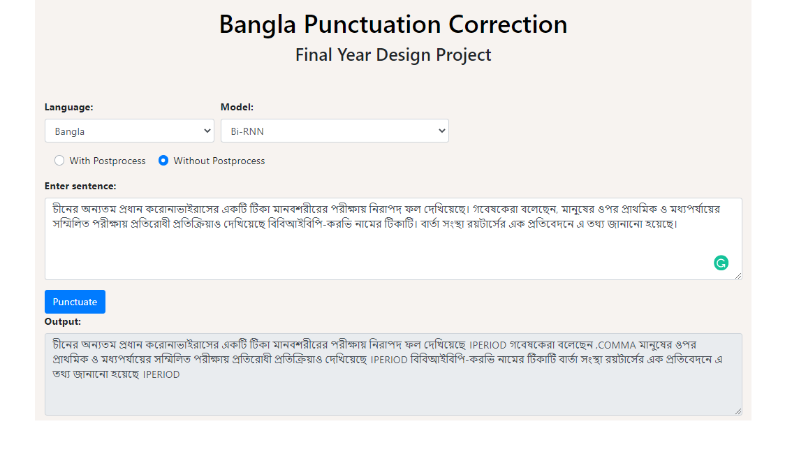
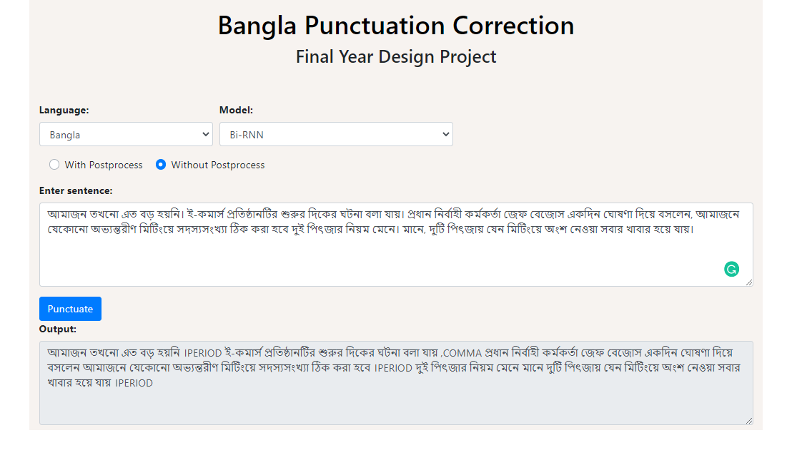

# Bangla-Punctuation-Corrector

This project focuses on restoring punctuation from Bangla text. We have prepared this as our "Final Year Design Project" course work. The project contains two major part: <br>
1. Prepare and train a model  
2. Deploy and create an application interface for testing.
<a/>
It was quite challenging to decide the 1st part as there were no existing work related to this task for Bangla. After investigating some deep learning model(mainly based on NLP) we choose Bi-Directional Recurrent Neural Network (GRU) with Attention mechanism as our base model. Our accurecy was not so high, but it gives us a threshold for any future 
work related to bangla punctuation task. We have also performed sevaral postprocessing technique to increase our machine output accurecy.

## Training

Please visit **[here]()** to read about training stage

## Testing Interface

We have used Flask API as a lightweight python framework to deploy a testing interface. Screenshots along with test case are given below. We intentionally put the restored punctuation 
with their name to identify model output.
<p align = "center">
    
    
</p>

## To Test the Model
1. Clone or download this repo
2. Download the pretrainned model from [here](https://drive.google.com/file/d/1-OyJ6HksBzO7xUaKRTApES9ht52iNVya/view?usp=sharing)
3. Put the model .pcl file into project directory
4. Create a vertual env in yout machine and install dependencies given in requirements.txt
5. run ```python api.py```
6. It will open the app into your localhost
7. Play :)

### Tools for Interface
- **[Flask](https://flask.palletsprojects.com/en/1.1.x/)**
- **[Python 3.7.9](https://www.python.org/)**
- **[Jquery](https://jquery.com/)**
- HTML, BOOTSTRAP
